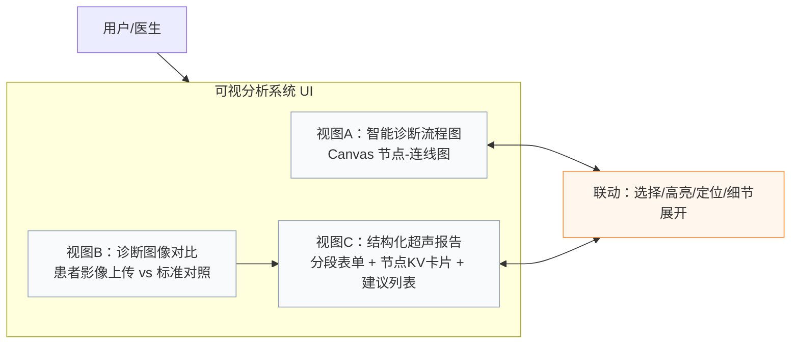
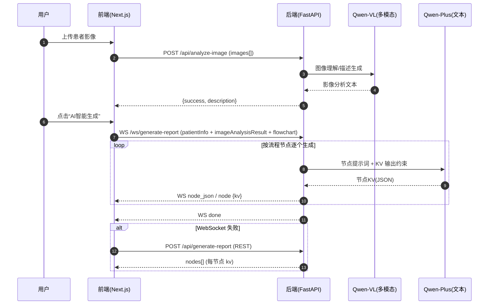

# 交互式医疗报告生成的可视分析系统：设计、交互与实现

（作者：_______；单位：_______；日期：2026-03-31）

## 摘要

医学影像辅助诊断的报告生成任务同时面临三类挑战：其一，影像证据与最终结论之间存在语义断层，临床人员难以快速核验“结论从何而来”；其二，生成式模型常以长文本形式输出，缺乏过程可追溯性与节点级质量定位能力；其三，多模型与前后端链路复杂，调试成本高且可用性易受网络与输出格式不确定性影响。为解决上述问题，本文基于现有实现提出一套面向超声报告生成的可视分析系统，采用“流程图—影像对比—结构化报告”的协调多视图（Coordinated Multiple Views, CMV）架构，将诊断流程显式化为图结构视图，将影像证据以并置方式呈现，并将模型输出约束为节点级结构化键值（KV）结果，以支持增量生成、跨视图联动、细节按需展开与报告可编辑落地。系统通过 WebSocket 实现节点级流式反馈，并在失败时降级至 REST 以保证可用性。本文进一步从视觉编码（visual encoding）与交互设计角度系统化拆解关键视图的通道选择与交互逻辑，论证该“可视化×交互×系统”合成方案在可解释性、可控性与工程可调试性方面的综合贡献。

## 关键词

可视分析；协调多视图；医疗报告生成；人机交互；视觉编码；多智能体；流式生成

---

## 1 引言

影像报告是医学影像诊断工作流中的关键产物，其质量直接影响临床决策。然而，在报告生成的自动化与智能化过程中，单纯追求“生成一段看起来合理的文本”往往带来新的问题：结论缺少可追溯依据、生成过程不可解释、系统链路难以调试与稳定交付。可视分析（Visual Analytics）强调人机协同：利用可视化与交互增强人的认知能力，同时把算法/模型的中间过程与不确定性暴露出来，使得用户能够在“证据—推理—结论”的闭环中完成核验与修正。

本文围绕一个超声医学检查报告生成原型系统，给出面向论文写作的系统化阐述：从问题与需求出发，解释三栏协调多视图的视图选择逻辑；从视觉编码与交互机制出发，拆解关键视图的 encoding 设计；从系统实现出发，总结多模型（多模态视觉模型 + 文本大模型）与前后端协同的数据流、接口契约与容错策略。

本文主要贡献可概括为：

1) **节点级结构化输出的可视化落地**：将模型输出从长文本提升为按流程节点组织的 KV 结构，并在报告视图中以节点卡片形式呈现，支持快速核验与问题定位。
2) **跨视图联动的人机协同流程**：以流程图为“过程视图”、影像对比为“证据视图”、结构化报告为“结果视图”，通过选择/高亮/定位与细节按需展开形成协同分析闭环。
3) **面向工程调试的流式可视反馈**：以 WebSocket 节点级消息流提供可视进度与降级路径提示，使系统可用性与可调试性显著增强。

---

## 2 问题定义与需求分析

### 2.1 问题定义

给定：患者超声影像（可多张）、既有/可编辑的诊断流程图（图结构）、患者基本信息与检查发现。目标：生成可复核、可编辑、可保存的结构化超声报告，并在生成过程中提供可视化解释与调试可见性。

### 2.2 需求（R）

- R1 可解释性：结论能够追溯到诊断流程中的具体节点，并显示该节点的依据（evidence）。
- R2 可控性：用户可对报告字段进行编辑，生成结果可落地为临床文书。
- R3 高效率：减少在证据/过程/结论之间切换的认知负担与操作成本。
- R4 可用性与可调试性：在流式生成、异常与降级路径下仍能给出明确反馈，并能定位到节点粒度。

---

## 3 系统概览与架构

### 3.1 协调多视图界面

系统采用三栏并置的协调多视图布局：流程图（过程）—影像对比（证据）—结构化报告（结果）。

图 1 展示系统界面总体结构。

**图 1：可视分析系统三栏界面整体结构（协调多视图）**



### 3.2 系统模块与实现对应

为便于“方法—实现”对齐，表 1 汇总关键视图与代码模块的对应关系。

**表 1：视图与实现模块对应关系**

| 视图/模块 | 主要职责 | 实现位置（示例） |
|---|---|---|
| 视图A 流程图 | 表达诊断流程图结构；节点选择与高亮 | components/flowchart-builder.tsx |
| 视图B 影像对比 | 影像上传、并置对比、AI分析结果展示 | components/medical-report-system.tsx |
| 视图C 结构化报告 | 分段阅读、节点KV结论卡片、建议列表、编辑保存 | components/medical-report-component.tsx |
| API 封装 | 前端到后端的接口请求 | lib/api.ts |

---

## 4 视图选择逻辑：数据—任务—视图匹配

本文采用“数据—任务—视图—交互”的经典可视化设计框架进行解释，并用“Overview first, zoom and filter, then details on demand”的策略组织交互（课程常用写法）。

### 4.1 数据类型

- D1 流程数据：节点类型（start/process/decision/end）、连接关系、（可选）决策节点的解释字段。
- D2 影像数据：患者影像（栅格图像）与标准对照影像。
- D3 文书数据：患者信息、检查发现、节点级结论/依据/建议（结构化文本）。

### 4.2 任务分解

- T1 流程理解：把握诊断步骤的整体结构、分支与顺序。
- T2 证据核验：对比影像并阅读 AI 分析条目，形成检查发现。
- T3 结论复核：按节点阅读结论与依据，识别异常输出或缺失项。
- T4 输出落地：编辑与保存报告，使其满足文书规范。
- T5 工程调试（系统任务）：定位生成到哪个节点、失败原因与降级路径。

### 4.3 视图选择理由

- V1 节点-连线图适配图结构数据（D1），可直观表达流程结构并支持节点选择（T1/T5）。
- V2 并置对比适配栅格影像（D2），支持患者 vs 标准参照的快速视觉比较（T2）。
- V3 结构化分段与卡片列表适配文书数据（D3），支持逐段阅读、逐节点核验与可编辑落地（T3/T4）。

---

## 5 人机交互设计

交互是本系统的关键贡献点之一。本文将交互分为“跨视图联动交互”与“单视图内交互”，并给出与任务的对应关系。

### 5.1 交互—任务映射

**表 2：交互机制与任务映射**

| 交互机制 | 触发方式 | 反馈/结果 | 支持任务 |
|---|---|---|---|
| 节点选择→报告定位 | 点击流程图节点 | 报告对应段落高亮/聚焦 | T1/T3 |
| 流式节点进度可视化 | 点击“AI智能生成” | 进度提示 + 节点卡片增量出现 | T3/T5 |
| 决策细节按需展开 | 点击 decision 节点 | 弹窗展示决策逻辑详情 | T1/T3 |
| 结论折叠/展开 | 点击“收起/展开” | 降低滚动负担 | T3 |
| 建议列表化呈现 | 自动/编辑后展示 | 编号列表、可执行条目 | T4 |
| WS 失败自动降级 | WebSocket error/close | 切换 REST 生成并提示 | T5 |

### 5.2 跨视图联动（Brushing & Linking）

跨视图联动将“过程视图（V1）”与“结果视图（V3）”绑定，形成面向核验的阅读路径：用户在流程图中选择节点，系统定位到报告的相应段落；而当模型流式生成到某节点时，也会同步触发报告侧聚焦与进度提示，从而在视觉上建立“生成过程与输出内容”的一一对应关系。

### 5.3 流式生成的交互可见性

系统通过 WebSocket 接收 `node_json / node / done` 消息，以节点为最小粒度展示生成进度。该设计将传统“不可见的后台推理”转化为“可观察、可定位、可解释”的过程性反馈：

- 面向用户：明确当前生成阶段与等待预期。
- 面向调试：若某节点输出质量异常或失败，可直接定位问题节点。

---

## 6 视觉编码（Visual Encoding）拆解

本节针对关键视图给出“数据字段→视觉通道→设计理由”的编码说明，以体现可视化设计的严谨性。

### 6.1 视图A：流程图（Node-Link Diagram）

流程图视图使用形状、颜色与描边/阴影等通道实现“类型区分—焦点强调—细节提示”的多层编码。

**表 3：流程图视图的视觉编码表**

| 数据/语义 | 视觉通道 | 具体编码 | 设计理由 |
|---|---|---|---|
| 节点类型（start/end/process/decision） | 形状（shape） | 圆/矩形/菱形 | 形状为强通道，支持快速类别分辨 |
| 节点类别 | 色相（hue） | start/end 青色；process 绿色；decision 紫色 | 利用颜色形成一致的语义分组 |
| 当前焦点（选中/跨视图高亮） | 色相+描边宽度 | 统一蓝色 + 加粗描边 | 强化“当前工作对象”的显著性 |
| 高亮强调 | 阴影/光晕（glow） | shadowBlur 增强 | 在节点密集时提升可见性与定位效率 |
| 决策节点含额外解释数据 | 符号叠加（glyph） | 右上角红点 | 作为“可展开细节”的可供性提示 |

### 6.2 视图B：影像对比（Juxtaposition）

影像对比视图采用并置布局与“标准”标签标注：

- 并置（juxtaposition）适合患者 vs 标准的直接视觉比较。
- 标签（label/glyph）把对照类别显式化，降低记忆负担。
- AI 分析结果以条目化文本呈现，作为从影像到 findings 的桥梁。

### 6.3 视图C：结构化报告（Node KV Cards）

结构化报告视图重点在于“按节点组织的 KV 卡片 + 建议列表化”，其编码策略强调可读性与可核验性。

**表 4：结构化报告视图的视觉编码表**

| 数据/语义 | 视觉通道 | 具体编码 | 设计理由 |
|---|---|---|---|
| 节点粒度的输出单元 | 分组（grouping） | 卡片按节点分组 | 支持节点级核验与快速定位 |
| 节点类型 | 颜色（text color） | 节点标题按类型着色 | 在文本空间中保留“流程语义” |
| 建议条目 | 有序列表（ordered list） | 编号 1..n | 强化执行性与逐条核对 |
| 长结论阅读负担 | 折叠（collapse） | 收起/展开 | 降低滚动与视觉拥挤 |

---

## 7 多智能体流水线与前后端协同实现

尽管系统 UI 呈现为三栏可视分析界面，其底层实现体现为“多阶段/多角色”的协作流水线：影像理解（多模态模型）→ 节点级推理（文本模型）→ 结构化输出解析与渲染。本文用“多智能体”概念强调任务分解与接口契约：每个流程节点可视为一个子任务/子代理（agent）的工作单元。

### 7.1 数据流与接口时序

图 2 给出系统关键调用链路。该链路同时覆盖正常流式路径与 WebSocket 失败后的 REST 降级路径。

**图 2：多阶段模型调用与前后端协同时序（含降级路径）**



### 7.2 结构化 KV 作为“接口契约”

系统把模型输出约束为节点级 KV 对象（如 `nodeId/nodeLabel/nodeType/evidence/conclusion/suggestions`），并在前端统一归一化后渲染。其意义在于：

1) 将不稳定的自由文本转化为可解析字段，为可视化与交互提供稳定输入。
2) 将质量问题定位到字段与节点层面，支撑调试与交互反馈。
3) 使“建议仅在 end 节点产生”等业务规则具备可验证性。

---

## 8 讨论：贡献、局限与未来工作

### 8.1 贡献总结（可直接用于论文 Contribution 段落）

- 以协调多视图将“过程—证据—结论”三类信息空间并置，并通过联动交互形成可视分析闭环。
- 以节点级结构化 KV 输出将生成式推理结果可视化、可核验、可调试，并降低黑盒性。
- 以流式节点反馈与降级机制提升系统可用性，支持工程调试与用户等待体验。

### 8.2 局限

- 影像对比当前以并置与文本分析为主，尚未引入区域级标注/分割等更强证据链接方式。
- 结构化 KV 的质量仍依赖模型遵循约束的程度；尽管可通过解析/归一化缓解，但无法从根本保证语义正确。

### 8.3 未来工作

- 引入更强的结构化约束机制（例如 JSON Schema / 函数调用风格），进一步降低输出格式异常。
- 增加不确定性表达（如字段置信度、异常标记）与针对性核验交互。
- 面向临床流程扩展更多节点类型与任务模板，支持多疾病场景迁移。

---

## 9 结论

本文给出一个面向超声报告生成的可视分析系统的论文式描述。系统以三栏协调多视图组织证据、过程与结论，以节点级结构化 KV 作为人机协同与可视化落地的关键接口，并通过流式反馈与降级策略提升可用性与可调试性。该方案强调“可视化—交互—系统”的合成贡献，为生成式模型在医疗文书场景中的可解释与可控落地提供了一种工程可实现的路径。

---

## 参考文献（占位）

[1] Shneiderman, B. The Eyes Have It: A Task by Data Type Taxonomy for Information Visualizations. *Proceedings of IEEE VL*, 1996.

[2] Keim, D. A. et al. Visual Analytics: Scope and Challenges. *Visual Data Mining*, 2008.

（注：此处可替换为你课堂指定阅读或论文要求格式，如 GB/T 7714。）

---

## 附录 A：接口与数据结构（写论文实现细节时可引用）

### A.1 关键接口（示例）

- POST `/api/analyze-image`：输入 images[]（base64 DataURL）；输出影像分析文本 description。
- WS `/ws/generate-report`：输入 patientInfo + imageAnalysisResult + flowchart；输出节点级流式消息。
- POST `/api/generate-report`：WS 失败时降级；输出 nodes[]（每节点 KV）。

### A.2 NodeKV（概念结构）

```json
{
  "nodeId": "string",
  "nodeLabel": "string",
  "nodeType": "start|process|decision|end",
  "evidence": "string",
  "conclusion": "string",
  "suggestions": ["string"]
}
```
